# ZenRoutine — Design 2019

**Source:** `Zen Routine-1.pdf`, 85 pages, dated 22 Jul 2019. It shows landscape iPad mocks drawn by hand, with typed and handwritten notes on them.

**How this was made:** Every page was rendered from the PDF with the Windows PDF API. The renders include both the typed text layer and the drawing layer. Every annotation below was transcribed from the rendered page, and every transcript was checked against the full render. The page images are committed next to this file as `design-2019/pNN.jpg`.

> **Warning.** The PDF's extracted text layer, and the older `claude_code_package/ZEN_ROUTINE_SPEC.md` built from it, leave out **every handwritten annotation**. Those annotations carry most of the product: tap-to-edit on the ribbon, optional type and estimate, drag-to-reprioritise, filter inheritance, the forecast calendar, the Pomodoro view, and the scheduled-versus-tracked distinction. Do not use either source as a spec.

**Authority:** This document is the reference for **user-visible behaviour**. Where it conflicts with one of the director's later decisions (section 3), the later decision wins. Where it is silent or contradicts itself, section 4 records an open question. Those questions are left unresolved on purpose. If a brief disagrees with this document, stop and raise it. Do not pick one yourself.

**Conventions**
- `> "..." — pNN, colour` is a handwritten annotation, quoted verbatim with the page's own spelling. `[illegible]` would mark an unreadable word; none were needed.
- "Typed" text is part of the PDF's typed layer. Black handwriting inside a mock is on-screen UI content, not an annotation.
- Annotation colours: **red** means a salmon or coral red pen (p10–p43, p65–p66). **orange** means an orange pen (p44–p64, p67–p77). **black** is used once, on p03.
- Times are written as the page writes them (`7.15am`, `10.15-12.45`).

---

## 1. Contents

1. Contents
2. Page index
3. Decisions since 2019 that override the design
4. Screens
   - 4.1 Concept pages and onboarding
   - 4.2 Routine builder
   - 4.3 Routine breakdown pie
   - 4.4 Goals
   - 4.5 Planning overview and forecast calendar
   - 4.6 Tracking: Day Overview and Current Activity
   - 4.7 Notifications
   - 4.8 Out of scope pages
5. Colour and activity-type key
6. Glossary
7. Corrections to the 14 Sep review

---

## 2. Page index

| Page | Screen | Image |
|---|---|---|
| p01 | Title page, "ZenRoutine / Working Title" (typed only) | [p01](design-2019/p01.jpg) |
| p02 | Core Concepts (typed) | [p02](design-2019/p02.jpg) |
| p03 | Goals: examples (typed, one black note) | [p03](design-2019/p03.jpg) |
| p04 | Activity Types: examples (typed) | [p04](design-2019/p04.jpg) |
| p05 | Routine: definition (typed) | [p05](design-2019/p05.jpg) |
| p06 | Why? (typed) | [p06](design-2019/p06.jpg) |
| p07 | Divider: "How?" | [p07](design-2019/p07.jpg) |
| p08 | Login / Welcome | [p08](design-2019/p08.jpg) |
| p09 | Onboarding 1: active hours | [p09](design-2019/p09.jpg) |
| p10 | Onboarding 2: empty week strip | [p10](design-2019/p10.jpg) |
| p11 | Week strip: tapping Monday | [p11](design-2019/p11.jpg) |
| p12 | Zoom transition into Monday | [p12](design-2019/p12.jpg) |
| p13 | Day view: empty Monday timeline | [p13](design-2019/p13.jpg) |
| p14 | Day view: hold-and-slide guide caret | [p14](design-2019/p14.jpg) |
| p15 | Day view: release to commit a new activity | [p15](design-2019/p15.jpg) |
| p16 | Caret label zooming into a dialog (transition) | [p16](design-2019/p16.jpg) |
| p17 | Activity edit box: new, empty | [p17](design-2019/p17.jpg) |
| p18 | Activity edit box: editable fields | [p18](design-2019/p18.jpg) |
| p19 | Activity edit box: end time edited, tapping "+" | [p19](design-2019/p19.jpg) |
| p20 | New Activity Type dialog: empty | [p20](design-2019/p20.jpg) |
| p21 | New Activity Type dialog: filled (Hygiene) | [p21](design-2019/p21.jpg) |
| p22 | Activity edit box with Hygiene chosen | [p22](design-2019/p22.jpg) |
| p23 | Monday ribbon: first activity placed | [p23](design-2019/p23.jpg) |
| p24 | Monday ribbon: fully filled | [p24](design-2019/p24.jpg) |
| p25 | Week strip: first day scheduled | [p25](design-2019/p25.jpg) |
| p26 | Week strip: tapping Tuesday | [p26](design-2019/p26.jpg) |
| p27 | Tuesday day editor: empty, gear icon | [p27](design-2019/p27.jpg) |
| p28 | Tuesday day editor: gear tapped | [p28](design-2019/p28.jpg) |
| p29 | Day toolbar expanded: copy from another day | [p29](design-2019/p29.jpg) |
| p30 | Tuesday ribbon after copying Monday | [p30](design-2019/p30.jpg) |
| p31 | Tuesday ribbon: pinch zoom and drag-extent hints | [p31](design-2019/p31.jpg) |
| p32 | Zoom transition on the ribbon | [p32](design-2019/p32.jpg) |
| p33 | Zoomed ribbon (evening), at rest | [p33](design-2019/p33.jpg) |
| p34 | Zoomed ribbon: grabbing an extent handle | [p34](design-2019/p34.jpg) |
| p35 | Zoomed ribbon: extent dragged | [p35](design-2019/p35.jpg) |
| p36 | Zoomed ribbon: tap an activity to edit | [p36](design-2019/p36.jpg) |
| p37 | Edit popover: Entertainment block | [p37](design-2019/p37.jpg) |
| p38 | Edit popover: type dropdown open | [p38](design-2019/p38.jpg) |
| p39 | Edit popover: Development chosen | [p39](design-2019/p39.jpg) |
| p40 | Zoomed ribbon after the edit | [p40](design-2019/p40.jpg) |
| p41 | Tuesday ribbon zoomed out, edit applied | [p41](design-2019/p41.jpg) |
| p42 | Week strip fully planned + breakdown pie | [p42](design-2019/p42.jpg) |
| p43 | Routine Breakdown (pie + ranked bars) | [p43](design-2019/p43.jpg) |
| p44 | Breakdown screen with an empty Goals panel | [p44](design-2019/p44.jpg) |
| p45 | Tapping the Goals panel (expands) | [p45](design-2019/p45.jpg) |
| p46 | Goals: empty, zooming in | [p46](design-2019/p46.jpg) |
| p47 | Goals: tapping the first row | [p47](design-2019/p47.jpg) |
| p48 | Goals: first row in edit mode | [p48](design-2019/p48.jpg) |
| p49 | Goals: typing the first goal | [p49](design-2019/p49.jpg) |
| p50 | Goals: goal committed, default controls | [p50](design-2019/p50.jpg) |
| p51 | Goals: row anatomy explained | [p51](design-2019/p51.jpg) |
| p52 | Goals: tapping the type box | [p52](design-2019/p52.jpg) |
| p53 | Goals: type picker open | [p53](design-2019/p53.jpg) |
| p54 | Goals: type chosen | [p54](design-2019/p54.jpg) |
| p55 | Goals: tapping the estimate | [p55](design-2019/p55.jpg) |
| p56 | Goals: editing the estimate | [p56](design-2019/p56.jpg) |
| p57 | Goals: estimate typed | [p57](design-2019/p57.jpg) |
| p58 | Goals: estimate committed | [p58](design-2019/p58.jpg) |
| p59 | Goals: populated list | [p59](design-2019/p59.jpg) |
| p60 | Goals: filter explained | [p60](design-2019/p60.jpg) |
| p61 | Goals: tapping the filter | [p61](design-2019/p61.jpg) |
| p62 | Goals: filter picker open | [p62](design-2019/p62.jpg) |
| p63 | Goals: choosing Work | [p63](design-2019/p63.jpg) |
| p64 | Goals: filtered to Work | [p64](design-2019/p64.jpg) |
| p65 | Goals (Work filter): drag to reprioritise | [p65](design-2019/p65.jpg) |
| p66 | Goals (Work filter): mid-drag | [p66](design-2019/p66.jpg) |
| p67 | Goals (Work filter): reordered; add inherits filter type | [p67](design-2019/p67.jpg) |
| p68 | Planning overview; calendar icon | [p68](design-2019/p68.jpg) |
| p69 | Forecast calendar (month) | [p69](design-2019/p69.jpg) |
| p70 | Divider: "Tracking" | [p70](design-2019/p70.jpg) |
| p71 | Tracking mode introduction (typed) | [p71](design-2019/p71.jpg) |
| p72 | Planning overview; stopwatch icon (mode switch) | [p72](design-2019/p72.jpg) |
| p73 | Tracking: Day Overview tab | [p73](design-2019/p73.jpg) |
| p74 | Tracking: Day Overview explained | [p74](design-2019/p74.jpg) |
| p75 | Tracking: Current Activity (LIVE) | [p75](design-2019/p75.jpg) |
| p76 | Tracking: Current Activity controls explained | [p76](design-2019/p76.jpg) |
| p77 | Tracking: Current Activity (IDLE, untracked time) | [p77](design-2019/p77.jpg) |
| p78 | Lock-screen notification | [p78](design-2019/p78.jpg) |
| p79 | Notification expanded with actions | [p79](design-2019/p79.jpg) |
| p80 | Notification: missed-notification note (same drawing as p79) | [p80](design-2019/p80.jpg) |
| p81 | Placeholder: "Metrics/Analysis (TODO)" | [p81](design-2019/p81.jpg) |
| p82–p85 | Out of spec: "Notes/Doodles" divider (p82), empty frame with a dropdown (p83), sample weekday routine list (p84), form controls (p85) | [p82](design-2019/p82.jpg) · [p83](design-2019/p83.jpg) · [p84](design-2019/p84.jpg) · [p85](design-2019/p85.jpg) |

Divider or near-blank pages: p01 (title), p07 ("How?"), p70 ("Tracking"), p81 (TODO placeholder), p82 ("Notes/Doodles").

---

## 3. Decisions since 2019 that override the design

| # | Decision | Effect on this document | Source |
|---|---|---|---|
| 1 | **The routine is made of activity types only.** A routine block never names a goal (`RoutineBlock.goalId` is removed). Goals take minutes from their type's pooled time, in priority order. | Matches p05 ("Activity Type scheduled on Weekly Timeline") and the p17–p22 edit box, which has only an Activity Type field. No routine-builder page may grow a goal picker. | [#60](https://github.com/RogueKostas/ZenRoutine/issues/60); review 17:14; `ITERATION-1-PLAN.md` decision 1 |
| 2 | **Goal priority is list order**, not an enum. | Matches p65–p67. There is no priority field, column or chip. | [#49](https://github.com/RogueKostas/ZenRoutine/issues/49); review 26:17; `CLAUDE.md` |
| 3 | **The bottom tab bar stays.** Screen content becomes faithful to the design. | The design has no tab bar. Its single planning surface with calendar and stopwatch icons (p68, p72) is parked. Its screens are rebuilt inside the existing tabs (Home, Routine, Goals, Analytics, Settings). | `ITERATION-1-PLAN.md` decision 2; [#56](https://github.com/RogueKostas/ZenRoutine/issues/56), [#58](https://github.com/RogueKostas/ZenRoutine/issues/58) |
| 4 | **A catch-up queue replaces the notification drumbeat** on p78–p80. On opening the app, the user confirms past blocks ("did that" / "did not do it") and can use a slider to say how far they deviated. Live tracking becomes a preference. | Section 4.7 is superseded as the default flow. The work is scheduled for **Iteration 2**. | Review 21:27; [#57](https://github.com/RogueKostas/ZenRoutine/issues/57) |
| 5 | **The week starts on Monday by default**, with a setting to change it. | Matches the design's `M T W T F S S` strips (p10, p25, p42) and its Monday-first calendar (p69). The setting is an addition. | Review 12:11 (D5); [#44](https://github.com/RogueKostas/ZenRoutine/issues/44) |

Later direction that **fills gaps** in the design without contradicting it:
- **Pomodoro cadence.** The default is 25 min work, 5 min break, and a 15 min break after four pomodoros. Settings can turn it off. The design shows five tomatoes but no timings (review 09:30).
- **Forecast algorithm.** Forecasting is a fill-forward walk of the routine. Each block's minutes go to that type's goals in list order, and a goal's forecast date is the day its estimate runs out. This needs no tracking history (review 27:18). The design only says the calendar "combines data from your goals and your currently active routine" (p69).
- **Calendar zoom.** Month is the default view, with day and week zoom available (review 27:18).
- **Estimate input.** Entries such as `12h` and `12hr` are accepted (review 15:06). The design shows a bare number becoming `hrs` (p57–p58).
- **Phone first.** The phone is the product and web is where reviews happen. The iPad 4:3 frames give proportions, not a target device (review 02:22, 04:47).

---

## 4. Screens

### 4.1 Concept pages and onboarding (p01–p09)

**Pages:** p01–p07 (typed concept pages), p08 (login), p09 (active hours).

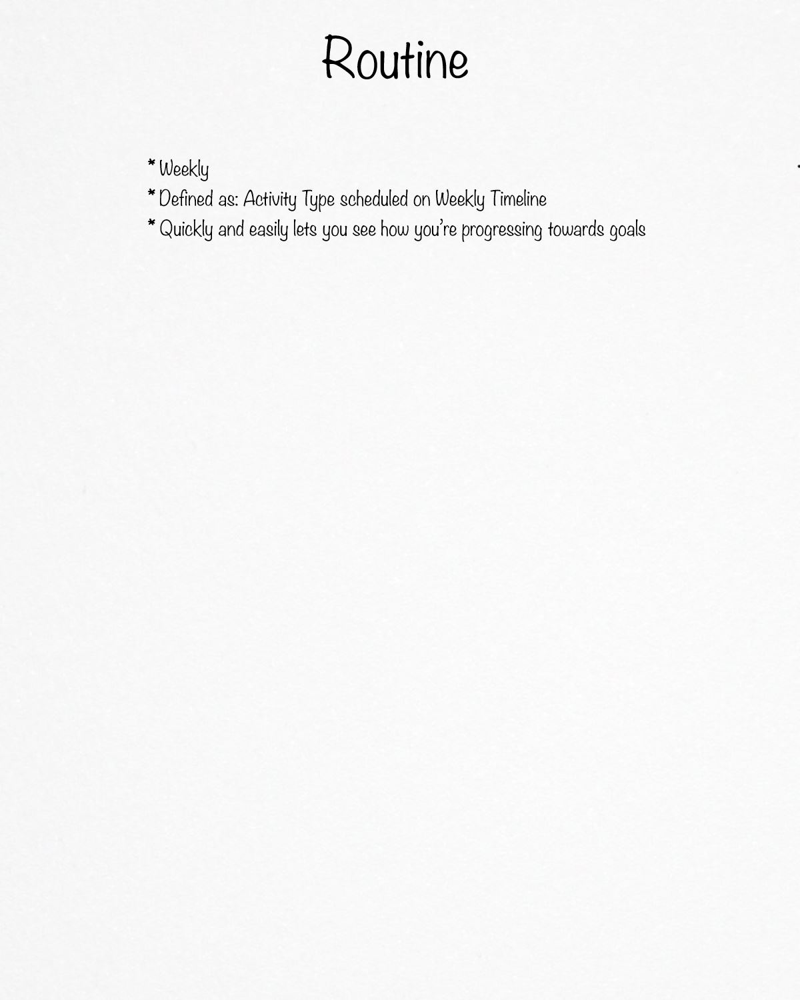
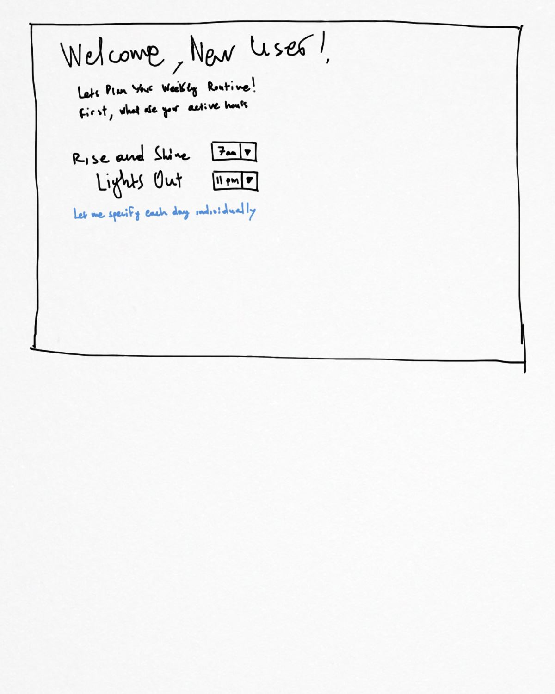

**What the screens are**
- **p02 Core Concepts** (typed): "Goals", "Activities / Activity Types", "Routine". These are "(all loose concepts / user defined / minimal assumptions by app about intended usage)". Also listed: "Tracking" and "Analysis".
- **p03 Goals: examples** (typed): "Follow up with John", "Implement Facebook login feature", "Learn Spanish", "Lose 10kg", "Take kids kayaking", "Catch up with Stranger Things 2", "...".
- **p04 Activity Types: examples** (typed): #Dayjob #SideProject #FamilyTime #Health #PersonalDevelopment #Entertainment #Social #Commute #Food #Hygiene #...
- **p05 Routine** (typed): "Weekly". "Defined as: Activity Type scheduled on Weekly Timeline". "Quickly and easily lets you see how you're progressing towards goals".
- **p06 Why?** (typed). The main points: a realistic outlook on available time; managing self-expectations; "Constant yet immediate / frictionless tracking helps with focus / procrastination (eg MyFitnessPal)"; "Design and Save different routines. Use appropriate routine depending on external factors / current goal focus." The page aims to reduce ambiguity around how you *plan* to spend your time, how you *can realistically* spend it, and how you *actually* spend it.
- **p08 Login / Welcome.** The title is "Welcome!". It has "User" and "Password" text fields, a blue "New Account" link at the bottom left, and a small boxed "OK" button at the bottom right.
- **p09 Onboarding 1.** Handwritten heading "Welcome, New User!", then "Lets Plan Your Weekly Routine!" and "First, what are your active hours". There are two rows: "Rise and Shine" with dropdown `7am ▼`, and "Lights Out" with dropdown `11pm ▼`. Below them is a blue link: "Let me specify each day individually".

**Annotations, verbatim**
> "(note: should be measurable ideally)" — p03, black. A long arrow points at the "Learn Spanish" example specifically.

**Behaviour rules**
- The app makes minimal assumptions. Goals, activity types and routines are all user-defined (p02).
- A routine is weekly. It is made of **activity types** placed on a weekly timeline (p05).
- A user can design and save **several routines** and use whichever fits (p06). There is one "currently active routine" at a time (p69).
- Goals should ideally be measurable, but the app does not enforce this (p03).
- Onboarding first asks for the user's active hours: a wake time (default 7am) and a sleep time (default 11pm) (p09). These hours set the start and end of the day timeline (p13).
- Active hours can be set for each day separately via "Let me specify each day individually" (p09).

**Open questions / inconsistencies**
- p08 shows an account login. Accounts are out of scope for Iteration 1 (`ITERATION-1-PLAN.md`).
- No page shows the "Let me specify each day individually" flow (p09).
- The example types on p04 include `#Dayjob`, `#SideProject`, `#Social`, `#Food`. The mocks later use "Work", "Development"/"Personal Development", "Fitness"/"Health" and meal names instead (see section 5).
- p06 promises saved, switchable routines, but no page shows how to create, pick or switch a routine.

---

### 4.2 Routine builder (p10–p41)

**Pages:** p10–p16 (week strip, zoom into a day, add an activity by press-and-release), p17–p22 (activity edit box, new activity type), p23–p24 (the ribbon), p25–p30 (week strip, copy from another day), p31–p36 (pinch zoom, dragging extents, tap to edit), p37–p41 (editing an activity's type).

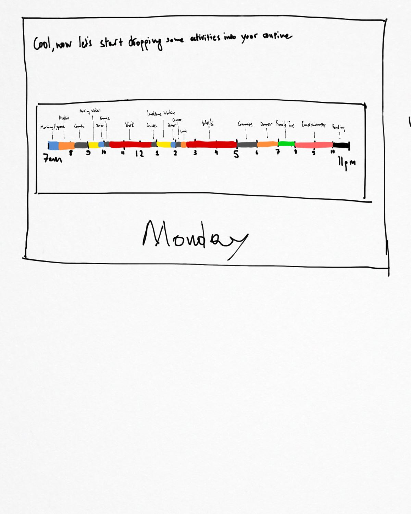
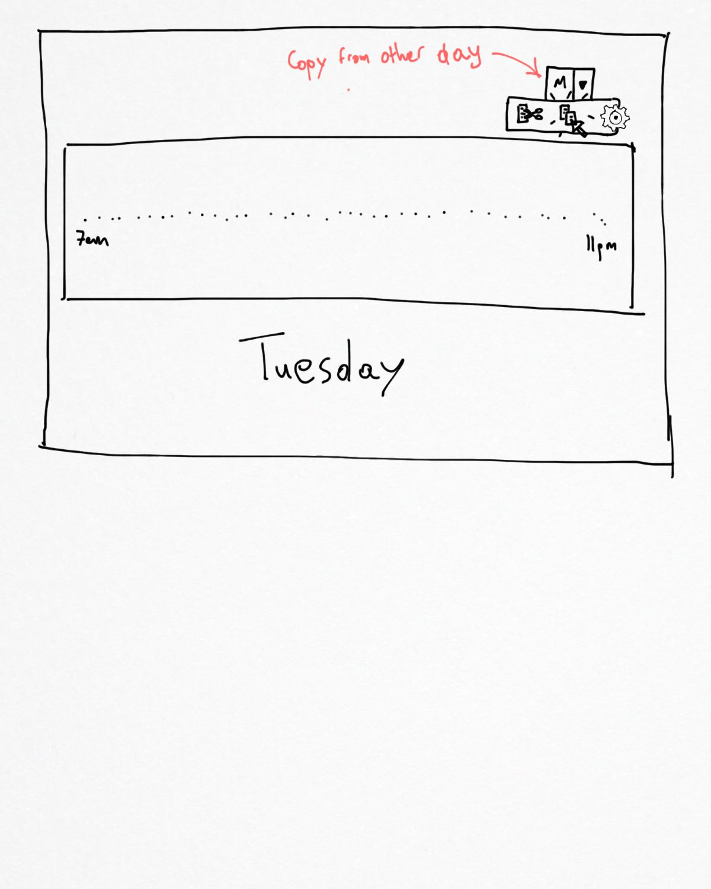
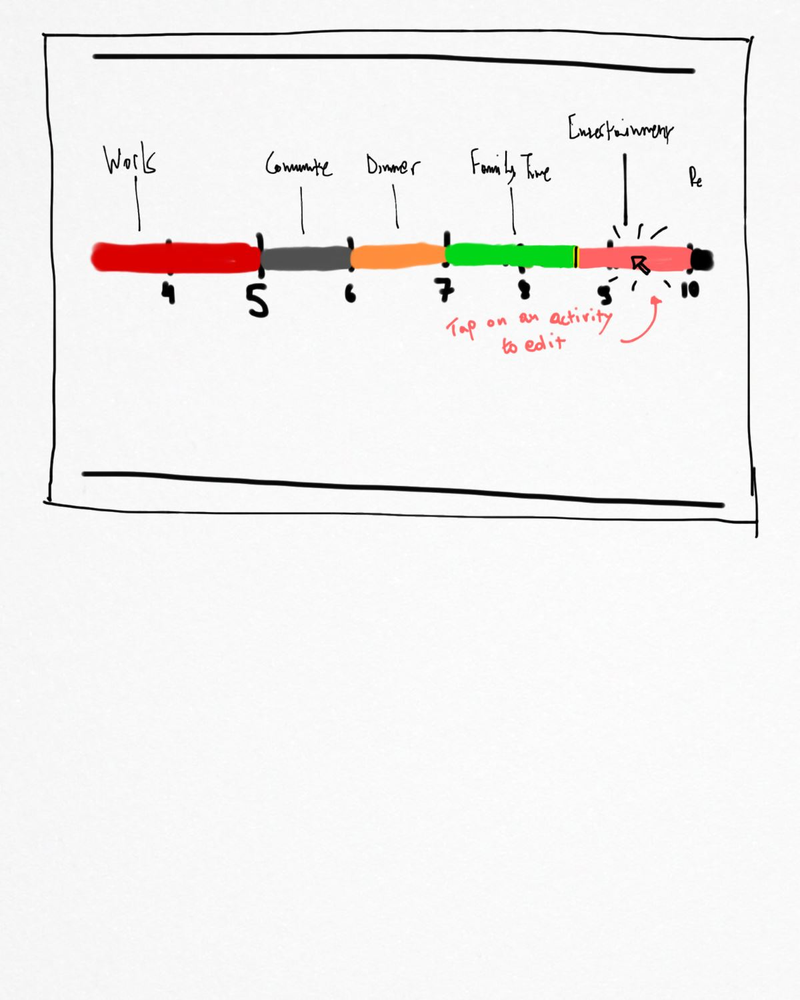

**What the screen is**

*Week strip (p10, p25, p26, p42).* A horizontal row of seven equal cells, labelled `M T W T F S S` above them. Monday comes first. An empty day is an empty cell. A planned day is filled with thin vertical coloured stripes, which are that day's ribbon squashed into the cell (p25). The heading on p10 reads "Cool, now let's start dropping some activities into your routine". Once Monday is filled, p25 shows the typed message "Great, that's your first day scheduled! Now you can use this a template to schedule more days". Tapping a day zooms into it; p12 shows the zoom transition.

*Day view / day editor (p13–p16, p27).* A wide panel holds a horizontal timeline. It runs from the active-hours start (`7am`, labelled below the left end) to the end (`11pm`, labelled below the right end). Empty time is drawn as a dotted line. The day name ("Monday", "Tuesday") is written large below the panel. From p27 onward, a **gear icon** sits above the panel's top-right corner.

*Adding an activity (p13–p16).* The user presses anywhere on the timeline and holds. A **guide caret** appears: a vertical line from the finger up to a boxed time label (for example `11.15am`) above the panel. The label follows the finger as it slides left or right (p14). Releasing commits a new activity at that time (p15), and the caret label zooms open into the activity edit box (p15–p16).

*Activity edit box (p17–p19, p22, p37–p39).* A modal dialog with these parts:
- A trapezoid **time tab** on top, showing `( 7am - 8am )`. A new activity defaults to 1 hour. The tab's left edge carries a diagonal stroke in the activity's colour.
- A small square **icon tile** at the top right. It shows `?` until a type is chosen, then the type's icon with a bar in the type's colour.
- The label `Activity Type:`, a dropdown (`▼`) and a circled `+` button that creates a new type.
- `Cancel` at the bottom left and `OK` at the bottom right.

The start time, end time and type can all be edited in place (p18). p19 shows the end time changed to `7.15am`, drawn in blue as a user-edited value. The type dropdown (p38) is a scrolling list whose items are coloured by type: "Health" (yellow), "Development" (magenta), "Work" (red, clipped). p22 shows `Hygiene` chosen, with a blue swatch and a shower-head icon. p37 shows an existing block, `( 8.30pm - 10pm )` Entertainment, with a salmon swatch and a gamepad icon. In p39 it becomes Development, with a magenta swatch and a brain icon.

*New Activity Type dialog (p20–p21).* A full-frame dialog titled "New Activity Type", with the fields `Name:` (text), `Colour:` (a circular swatch) and `Icon:` (a square box with `?`), plus `Cancel` and `OK`. The filled example on p21 is Name `Hygiene`, a solid blue colour, and a shower-head icon.

*The ribbon (p23–p24, p30, p41).* The planned day is one continuous thick bar from 7am to 11pm, coloured by activity type. Hour ticks with numbers sit below it (8, 9, 10, 11, 12, 1 … 10). Short black tick marks separate the segments. Each segment has a small **label above it on a leader line**, and label heights alternate so they do not collide. The label is the block's own name (for example "Morning Hygiene", "Lunchtime Workout"), not only its type name. Sample Monday (p24):

| Block | Colour | Approx. time |
|---|---|---|
| Morning Hygiene | blue | 7:00–7:30 |
| Breakfast | orange | 7:30–8:15 |
| Commute | dark grey | 8:15–9:00 |
| Morning Workout | yellow | 9:00–9:30 |
| Shower | blue | 9:30–9:50 |
| Commute | grey | 9:50–10:15 |
| Work | red | 10:15–1:00 |
| Commute | grey | ~1:00–1:10 |
| Lunchtime Workout | yellow | 1:10–1:55 |
| Shower | blue | ~1:55–2:05 |
| Commute | grey | 2:05–2:20 |
| Lunch | orange | 2:20–2:35 |
| Work(s) | red | 2:35–5:00 |
| Commute | grey | 5–6 |
| Dinner | orange | 6–7 |
| Family Time | green | 7–~7:50 |
| Entertainment | salmon/pink | ~7:50–10 |
| Reading | black | 10–11 |

(The p84 doodle gives cleaner times for the same day. See section 4.8.)

*Day toolbar: copy from another day (p27–p30).* Tapping the gear (p28) expands it into a horizontal toolbar (p29). From left to right the toolbar holds a document-with-scissors icon, a copy icon (two stacked documents) and the gear. Tapping copy pops up a day picker, `M ▼`, which selects the source day. After the copy, Tuesday's ribbon matches Monday's and the toolbar collapses back to the gear (p30).

*Pinch zoom and extents (p31–p35).* Pinching zooms the ribbon. p32 shows the transition and p33 the zoomed evening, about 3:30pm to 10pm, with larger, more widely spaced labels and thick black bars above and below. At a boundary between two blocks there is a small **yellow drag handle** (p34, and already visible on p36). Dragging it moves the boundary. On p35, Family Time grows to about 8:40 and Entertainment shrinks, and both labels re-centre.

*Tap to edit (p36–p41).* Tapping a segment opens its edit box (p37). In p38–p39 the type changes from Entertainment to Development. The segment turns magenta and is labelled "Personal Development" (p40). Zooming back out shows the edited full-day ribbon (p41).

**Annotations, verbatim**
> "zoomable Canvas" — p10, red (arrow to the week strip)

> "Tap a day / or pinch to zoom in" — p10, red (arrow to the Monday cell)

> "Tap" — p11, red (with a circle and touch mark on Monday). Also "Tap" — p26, red (on Tuesday)

> "Press and Release anywhere to add a new Activity" — p13, red. The word "anywhere" is scrawled like "anyhere".

> "Guide Caret appears when you hold & slide" — p14, red. The "C" of "Caret" looks like an "L".

> "1. Release to commit new Activity" — p15, red

> "2. Zoom into New Activity Dialogue Box" — p15, red

> "This is the Activity edit box" — p17, red

> "All these bits are editable" — p18, red. It comes with red boxes around `7am` and `8am` and a tap mark on the type dropdown.

> "Copy from other day" — p29, red (arrow to the `M ▼` source-day picker)

> "Pinch Zoom" — p31, red (arrow to the ribbon)

> "and drag activity extents around to adjust" — p31, red (arrow to the Family Time / Entertainment boundary)

> "Tap on an activity to edit" — p36, red (arrow to the tapped Entertainment segment)

**Behaviour rules**
- The week view is a zoomable canvas. Tapping a day, or pinching, zooms into that day (p10–p12).
- The week runs Monday to Sunday (p10, p25).
- A new activity is added by pressing anywhere on the day timeline and releasing (p13).
- While the user holds and slides, a guide caret shows the time under the finger (p14). The design samples it at quarter hours (`11.15am`, p14; `7.15am`, p19).
- Releasing commits the new activity at the caret's time, and the caret zooms into the activity edit box (p15–p16).
- A new activity defaults to one hour (p17: `7am - 8am`).
- In the edit box, the start time, end time and activity type are all editable in place (p18).
- The edit box has **only** an Activity Type field. A routine block has a time range and a type, and no goal field (p17–p22; section 3, decision 1).
- A new activity type can be created from inside the edit box with the `+` button (p19). A type has a Name, a Colour and an Icon (p20–p21).
- Each segment takes its type's colour. The edit box's swatch and icon tile update when the type changes (p22, p37, p39).
- Each segment has its own label (for example "Morning Workout" versus "Lunchtime Workout", both yellow) (p24).
- A day can be filled by copying another day. The toolbar is opened from the gear icon on the day view (p28–p30).
- The ribbon supports pinch zoom (p31–p33).
- A block's extents (its start and end) are changed by dragging the handle at a block boundary (p31, p34–p35).
- Tapping a block opens its edit box (p36–p37). Choosing a new type and pressing OK recolours the segment (p38–p41).
- The ribbon is the only editor for a day's routine. No page shows a list of block cards (p13–p41).

**Open questions / inconsistencies**
- **Development versus Personal Development.** The dropdown item is "Development" (p38–p39), but the ribbon label after the edit is "Personal Development" (p40–p41), and the breakdown uses "Personal Development" (p43). p04 lists `#PersonalDevelopment`. It is not clear whether the ribbon label is the block's own name or the type name.
- **Block name versus type name.** Labels such as "Morning Hygiene", "Shower" and "Morning Workout" are not type names. The edit box has no Name field (p17), yet on p23 the first block is labelled "Morning Hygiene" while its type is "Hygiene" (p22). The design never shows where a block's name is entered.
- **Time mismatch.** The p37 popover says `8.30pm`, but the dragged boundary on p35–p36 sits nearer 8:40. p41 draws it at about 8:30.
- **Toolbar scissors icon (p29)** is never explained. It could mean cut, clear or paste.
- **Copy scope.** p29 shows copying a whole day from a single chosen source day. Copying a range, or to several days, is not shown.
- **Snapping.** The design shows only quarter-hour values. No snapping rule is written.
- **Overlap and gaps.** No page says what happens when a new activity is dropped onto an existing block, or whether a dragged extent pushes or overwrites its neighbour. On p35 the neighbour shrinks.
- **Sunday/Saturday** routines are only shown as squashed strips (p42). No weekend day editor is drawn.

---

### 4.3 Routine breakdown pie (p42–p43)

**Pages:** p42, p43.

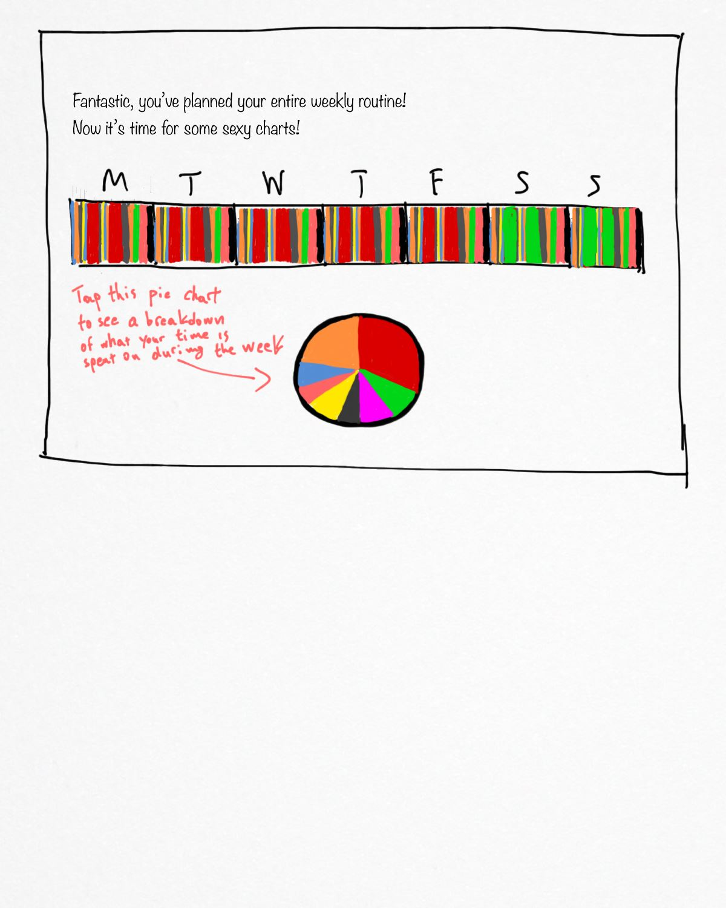
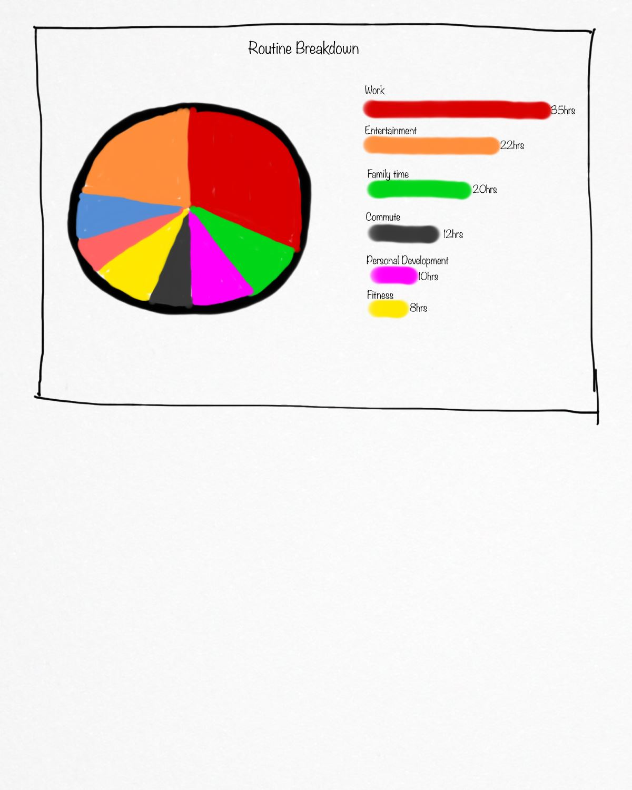

**What the screen is**
- **p42.** The typed message reads "Fantastic, you've planned your entire weekly routine! Now it's time for some sexy charts!". Below it is the fully planned 7-cell week strip. Monday to Friday are mostly red (Work); Saturday and Sunday are mostly green (Family Time). A pie chart with a thick black outline sits below the strip. Clockwise from 12 o'clock, its slices are red (largest, about 30%), green, magenta, dark grey, yellow, salmon, blue, and orange (about 20%).
- **p43 "Routine Breakdown"** (typed title). The same pie sits large on the left. On the right is a ranked horizontal bar chart, longest bar first. Each bar has its category name above its left end and its hours just past its right end:

| Category | Bar colour | Hours/week |
|---|---|---|
| Work | red | 35hrs |
| Entertainment | orange | 22hrs |
| Family time | green | 20hrs |
| Commute | dark grey | 12hrs |
| Personal Development | magenta | 10hrs |
| Fitness | yellow | 8hrs |

**Annotations, verbatim**
> "Tap this pie chart to see a breakdown of what your time is spent on during the week" — p42, red. The word "spent" could be read as "speat".

**Behaviour rules**
- The pie shows the week's planned time split by activity type (p42).
- Tapping the pie opens the Routine Breakdown: the pie plus bars ranked by hours per week, each bar labelled with its type and hours (p42–p43).
- Bar length is proportional to hours (p43).

**Open questions / inconsistencies**
- **Colour mismatch.** Entertainment is salmon on every ribbon (p24, p37) but orange on the p43 bar. Orange is the meals colour on the ribbon.
- **Pie versus bars.** The pie has 8 colours (including blue and salmon). The bar list has only 6 categories, with no meals, Hygiene or Reading. It is not said whether the bars are a top six or a filtered set.
- **Naming.** The bar says "Fitness", while the type picker says "Health" (p38, p53) and the ribbon says "Workout". The bar says "Family time" and the ribbon says "Family Time".
- The pie and bars show planned time only. p81 ("Metrics/Analysis (TODO)") suggests tracked-time analysis was meant to follow but was never designed.
- **Mode icons.** p42–p43 show **no** calendar or stopwatch icons, and neither do p44–p45. They first appear on p68 (calendar) and p72 (stopwatch). See section 7.

---

### 4.4 Goals (p44–p67)

**Pages:** p44–p46 (entry from the breakdown screen), p47–p58 (adding a goal and setting its type and estimate), p59–p64 (populated list and filter), p65–p67 (reprioritising, and adding inside a filter).

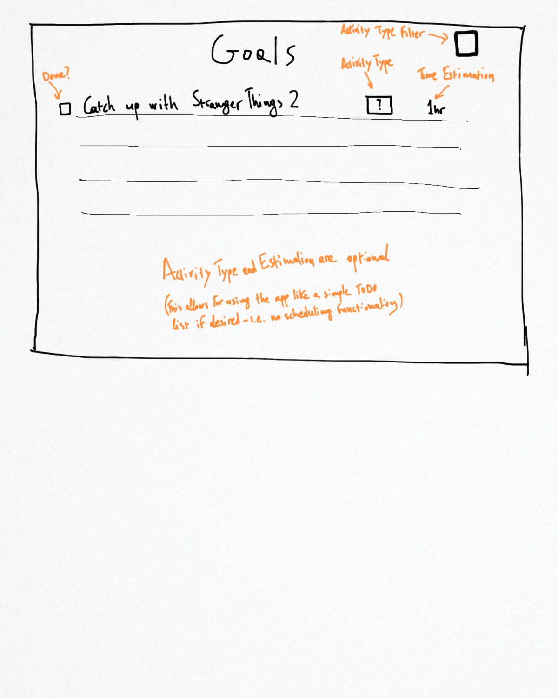
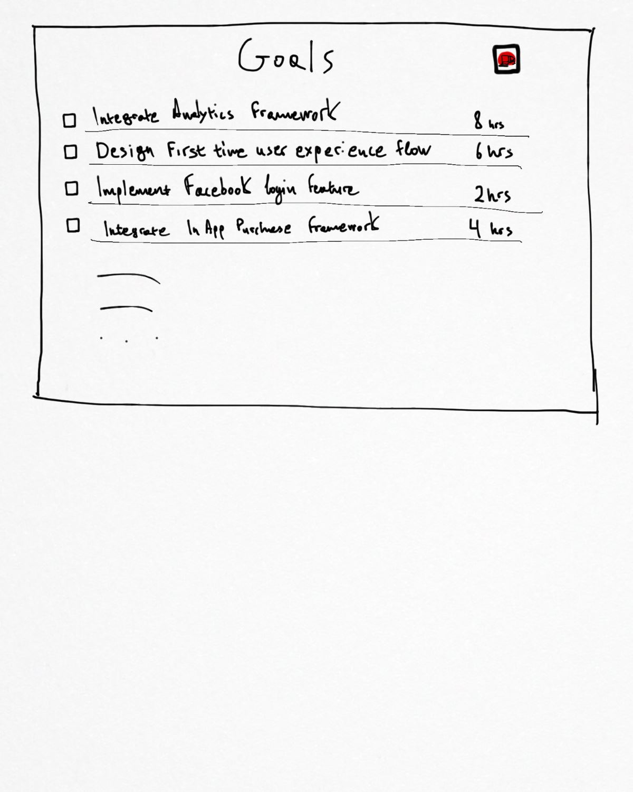
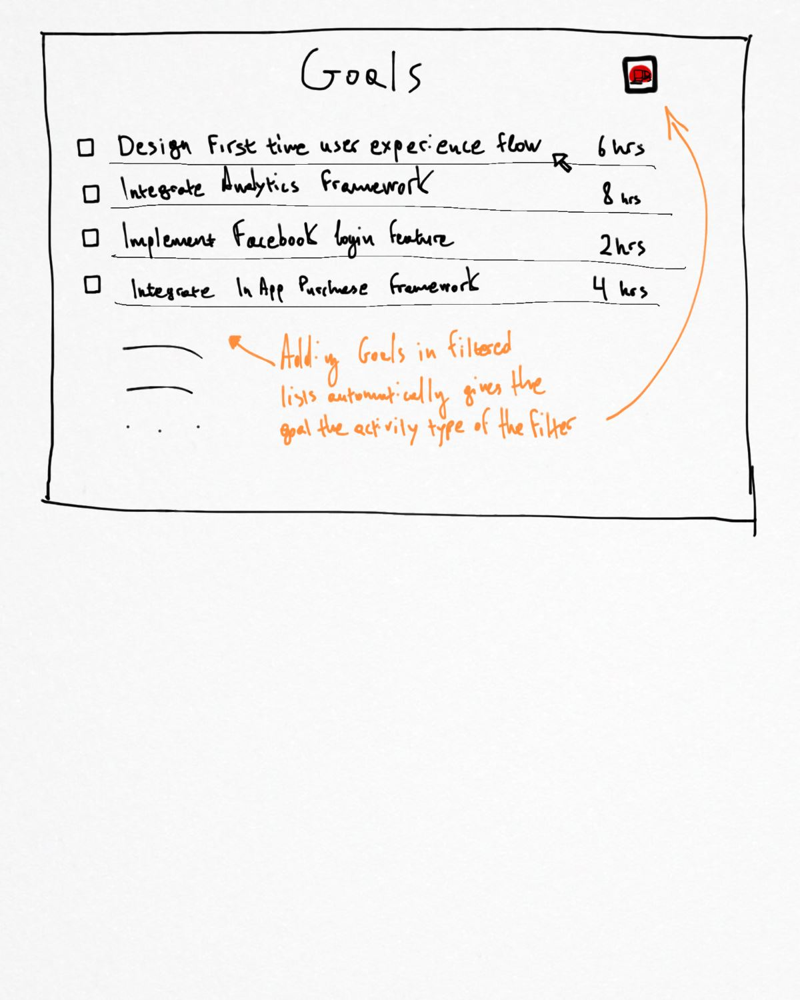

**What the screen is**

*Entry (p44–p46).* The breakdown screen has the typed text "Now finally, for the important bit: Goals!". It shows the week strip across the top, the "Breakdown" pie at the bottom left, and an empty "Goals" rectangle at the bottom right. Tapping the rectangle zooms it out to a full-screen Goals view (p45–p46).

*Goals screen.* A handwritten title, "Goals", is centred at the top. Below it is a ruled list. At the top right, in line with the title, is a bold square **filter button**. It is empty when no filter is set and shows the chosen type's icon when one is (p50, p64).

*Adding a goal (p47–p50).* The user taps an empty ruled line (p47). A blue text cursor appears in that line (p48). The user types the name, for example "Catch up with Stranger Things 2" (p49), and presses Enter (p49). The row then commits with its default controls (p50).

*Row anatomy (p50–p51):*
`[ ☐ done ] [ goal name, left-aligned, most of the width ] [ type box: "?" when unset ] [ estimate: "1hr" default ]`

*Setting the type (p52–p54).* Tapping the `?` box turns it into `...` and opens a dropdown below. The dropdown is a scrolling list. Each entry is a coloured circular icon plus a coloured label: "Entertainment" (salmon, game controller), "Health" (yellow, heart), "Development" (magenta, globe or brain), "Work" (red, clipped). Choosing an entry puts its icon in the box (p54).

*Setting the estimate (p55–p58).* Tapping `1hr` puts the field into inline edit mode, showing `1` with a cursor (p56). The user types `10` and presses Enter (p57), and the row reads `10hrs` (p58).

*Populated list (p59):*

| # | Goal | Type icon | Estimate |
|---|---|---|---|
| 1 | Catch up with Stranger Things 2 | salmon Entertainment (controller) | 10hrs |
| 2 | Follow up with John | blue circle, envelope glyph | 20min |
| 3 | Implement Facebook login feature | red Work | 2hrs |
| 4 | Lose 10kg | yellow Health (heart) | 72 hrs |

Below the rows are two short blank line stubs and `· · ·`, showing that the list continues or that there is an empty add slot.

*Filter (p60–p64).* Tapping the filter square turns it into `...` and opens a narrow, **icons-only** vertical dropdown (p62). It lists salmon Entertainment, blue envelope, red Work and yellow Health (partly cut off, so the list scrolls). Choosing Work (p63) puts the red Work icon in the filter button, and the list shows only Work goals, **with no type column** (p64):

| # | Goal | Estimate |
|---|---|---|
| 1 | Integrate Analytics framework | 8 hrs |
| 2 | Design First time user experience flow | 6 hrs |
| 3 | Implement Facebook login feature | 2hrs |
| 4 | Integrate In App Purchase framework | 4 hrs |

*Reprioritise (p65–p67).* In the Work-filtered list, the user drags "Design First time user experience flow" upward. On p66 the row is lifted and offset, and the row below is squashed as it is pushed down. The final order (p67) is: Design First time user experience flow (6 hrs), Integrate Analytics Framework (8 hrs), Implement Facebook login feature (2hrs), Integrate In App Purchase Framework (4 hrs). No priority column or value appears anywhere.

**Annotations, verbatim**
> "Tap here to start adding some goals" — p44, orange. The last word could be "goals" or "goal!".

> "TAP" — p45, orange (on the Goals panel). "TAP" also appears on p47 (first empty row), p52 (the `?` box), p55 (`1hr`) and p61 (filter square), all orange.

> "Hit Enter" — p49, orange (arrow to the cursor after the typed name)

> "Done?" — p51, orange (arrow to the checkbox)

> "Activity Type Filter" — p51, orange (arrow to the bold square at the top right)

> "Activity Type" — p51, orange (arrow to the `?` box)

> "Time Estimation" — p51, orange (arrow to `1hr`)

> "Activity Type and Estimation are optional" — p51, orange

> "(This allows for using the app like a simple ToDo list if desired - i.e. no scheduling functionality)" — p51, orange. The pen has "ToDo" looking like "TODO", and the dash is a short hyphen.

> "Enter" — p57, orange (arrow to the cursor after `10`)

> (no words) orange radiating selection strokes around the red Work icon in the filter dropdown — p63

> "Use the filter box to just see a single activity type" — p60, orange (arrow to the filter square)

> "Drag and move rows around to reprioritise" — p65, red. The same note appears again on p66, red. A red bracket-arrow runs from row 1 to row 2 (p65), and on p66 a curved red arrow at the right edge shows the two rows swapping. "around" is cramped.

> "Adding Goals in filtered lists automatically gives the goal the activity type of the filter" — p67, orange. One arrow points to the blank new-row lines and another to the Work filter icon.

**Behaviour rules**
- A goal is created by tapping an empty row, typing a name and pressing Enter. It is edited inline, with no separate form or page (p47–p50).
- Once committed, a goal row shows a done checkbox, the name, a type box and an estimate (p50–p51).
- The checkbox marks the goal done (p51).
- **Activity type is optional.** An unset type shows as `?` (p50–p51).
- **Estimate is optional** (p51). A new row shows `1hr` as its default (p50).
- With no type and no estimate, the goal list works as a plain to-do list with no scheduling (p51).
- The type is set by tapping the type box and choosing from a coloured, scrolling list of types. The box then shows that type's icon (p52–p54).
- The estimate is edited inline by tapping it. A bare number is committed in hours with the unit added (`10` becomes `10hrs`) (p55–p58).
- Estimates can be shown in minutes or hours (`20min`, `2hrs`, `72 hrs`) (p59).
- The filter box restricts the list to a single activity type (p60).
- The filter picker shows type icons only (p62). The chosen type's icon replaces the empty filter square (p64).
- In a filtered list the type column is hidden (p64–p67).
- **Priority is list position.** Rows are dragged to reorder them, and nothing else stores priority (p65–p67; section 3, decision 2).
- Reordering works inside a filtered list (p65–p67).
- **A goal added while a filter is active gets the filter's type automatically** (p67).
- The list ends with blank add-rows and `· · ·` (p59, p64, p67).

**Open questions / inconsistencies**
- **The unnamed envelope type.** "Follow up with John" has a blue circle with an envelope glyph (p59, p62, p68, p72). No page names this type. It is not among the labelled items visible in the p53 picker. It could be "Social" (listed on p04) or something like "Admin", but the design does not say.
- **Filter list contents.** The p62 filter dropdown shows exactly the four types present on the goals. It is unclear whether the filter lists all types or only those in use.
- **Clearing the filter.** No page shows how to go back to "all types".
- **Reordering while filtered.** p65–p67 reorder *within* the Work filter. How that order merges into the unfiltered list, whose rows are of mixed types, is not shown.
- **Default estimate versus optional estimate.** p50 shows `1hr` as a default, but p51 says estimation is optional. It is not said whether `1hr` is a real value or a placeholder.
- **Estimate units.** "72 hrs" and "8 hrs" have a space, but "10hrs" and "2hrs" do not. `20min` shows minutes, but no page shows how minutes are entered.
- **Icon glyphs.** The Work icon is drawn as something like a vehicle or bus on p53 and p65–p67, and like a computer or monitor on p73–p77. Development is drawn as a globe or a brain.
- **Capitalisation.** "Integrate Analytics framework" is written with a lower-case f on p64 but "Framework" on p65–p67.
- **Deleting and editing goals** (renaming, deleting, un-checking) are not shown.
- **Done goals.** What happens to a checked goal (it could be hidden, struck through or moved) is not shown.

---

### 4.5 Planning overview and forecast calendar (p68–p69, p72)

**Pages:** p68, p69, p72.

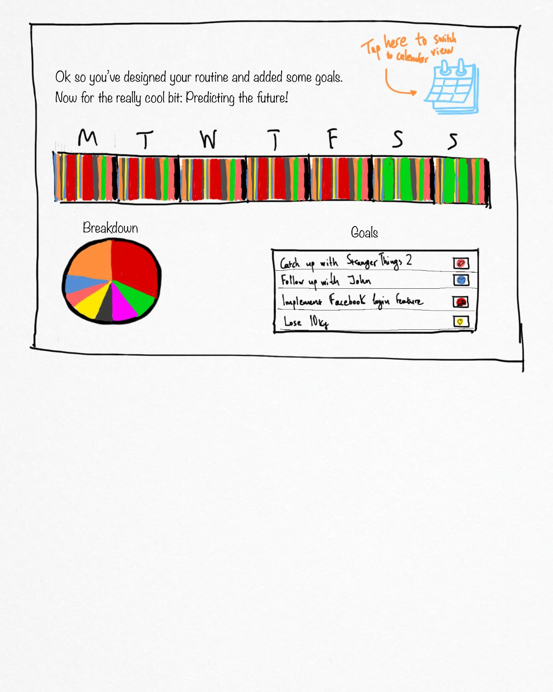
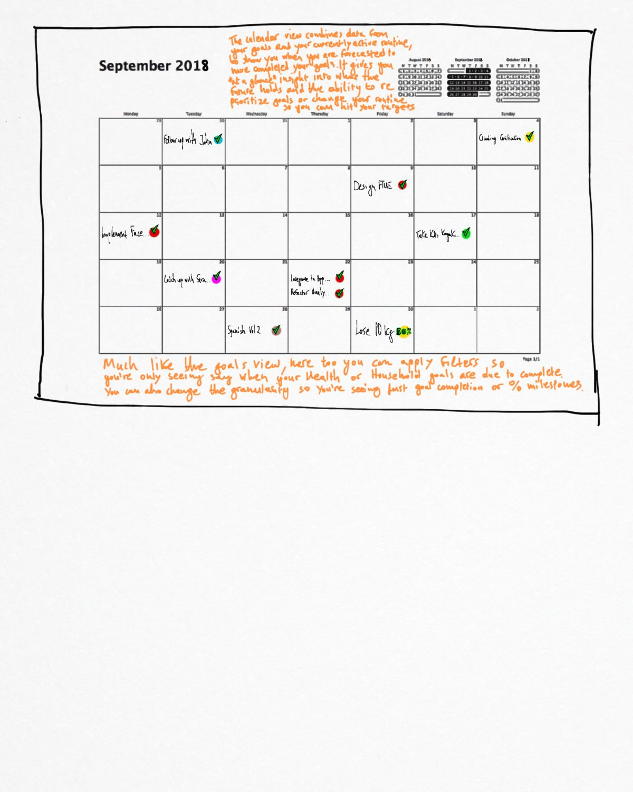

**What the screen is**

*Planning overview (p68, and p72 with the stopwatch added).* Typed text reads "Ok so you've designed your routine and added some goals. Now for the really cool bit: Predicting the future!" (p68) and "You can switch between the Tracking and Planning modes of Zen Routine at any given time" (p72). The screen has four parts:
- **Top right:** a light-blue spiral-bound **calendar icon** (p68). On p72 a cyan **stopwatch** with speed lines sits to its left.
- **Middle:** the M–S week strip of coloured columns. Weekdays are mostly red; Saturday and Sunday are mostly green.
- **Bottom left:** the "Breakdown" pie.
- **Bottom right:** a boxed "Goals" list. Each row has a name and a type icon on the right: Catch up with Stranger Things 2 (salmon), Follow up with John (blue), Implement Facebook login feature (red), Lose 10kg (yellow). No estimates or checkboxes are shown in this panel.

*Forecast calendar (p69).* A month grid on a printed calendar template, with these parts:
- The title "September 2018".
- Weekday headers Monday to Sunday.
- Mini-month calendars for August, September (highlighted) and October 2018 at the top right.
- "Page 1/1" at the bottom right.

The grid starts on Monday and has five rows (29 Aug to 2 Oct). Each forecast entry is a truncated goal name, a dot in the type's colour, and a green tick:

| Day | Entry | Dot |
|---|---|---|
| Tue 30 (Aug) | Follow up with John | cyan/blue |
| Sun 4 | Climbing Certification | yellow |
| Fri 9 | Design FTUE | red |
| Mon 12 | Implement Face... | red |
| Sat 17 | Take Kids Kayak... | green |
| Tue 20 | Catch up with Stra... | magenta |
| Thu 22 | Integrate In App... / Refactor Analy... | red / red |
| Wed 28 | Spanish Vol 2 | dusty pink/mauve |
| Fri 30 | Lose 10 kg | yellow, with a green **"50%"** label instead of a tick |

**Annotations, verbatim**
> "Tap here to switch to calendar view" — p68, orange (arrow to the calendar icon)

> "Tap the stopwatch to switch to tracking mode" — p72, orange (arrow to the stopwatch)

> "The calendar view combines data from your goals and your currently active routine, to show you when you are forecasted to have completed your goals. It gives you "at a glance" insight into what the future holds and the ability to re prioritize goals or change your routine so you can hit your targets" — p69, orange. "what" may be "whats", and "re" / "prioritize" is split across a line break.

> "Much like the goals view, here too you can apply filters so you're only seeing say when your Health or Household goals are due to complete. You can also change the granularity so you're seeing just goal completion or % milestones." — p69, orange. "just" is written like "fust".

**Behaviour rules**
- Planning and Tracking are two modes, and the user can switch between them at any time (p72). The stopwatch icon switches to tracking (p72) and the calendar icon switches to the calendar view (p68). *Section 3, decision 3 keeps the tab bar, so these icons are parked.*
- The calendar forecasts **when each goal will be completed**. It combines the goals (their order, type and estimate) with the **currently active routine** (p69).
- A forecast needs no tracking history; the routine and the goals are enough (p69, and section 3 on fill-forward).
- Each forecast entry shows the goal name (truncated) and a dot in the goal's type colour (p69).
- The purpose is to let the user re-prioritise goals, or change the routine, so that targets are met (p69).
- The calendar can be filtered by activity type, as the goals view can (p69).
- The granularity can be changed to show goal completions only, or also % milestones. A milestone is drawn as a percentage label such as `50%` in place of the tick (p69).
- The default view is a month grid that starts on Monday (p69). Day and week zoom come from later direction (section 3).

**Open questions / inconsistencies**
- **Tick meaning.** A green tick marks a *forecast* completion, not an actual one. The design does not say whether a goal that has really been completed looks different.
- **Colour mismatch.** "Catch up with Stra..." has a **magenta** dot on p69, but that goal is **salmon** Entertainment on p59, p68 and p72. "Take Kids Kayak..." is green (Family Time), a type never shown in a goal picker. "Spanish Vol 2" has a dusty pink or mauve dot that matches no other type. "Follow up with John" is cyan here and blue elsewhere.
- **Goals missing from the list.** "Climbing Certification", "Refactor Analy...", "Spanish Vol 2" and "Take Kids Kayak..." appear on the calendar but not in any drawn goals list.
- **"Household"** is named as a filter example (p69) but appears nowhere else.
- **Filter and granularity controls** are described but not drawn on p69.
- **The 2018 dates** on a 2019 document show that the calendar is a template, not a real forecast.
- **Several goals on one day** (Thu 22) are stacked. No overflow rule is given.
- The p68/p72 overview is one screen combining the week strip, pie and goals. The routine day editor and the goals screen are reached by zooming into its parts (p10–p12, p44–p46).

---

### 4.6 Tracking: Day Overview and Current Activity (p70–p77)

**Pages:** p70 (divider), p71 (typed introduction), p73–p74 (Day Overview), p75–p77 (Current Activity).

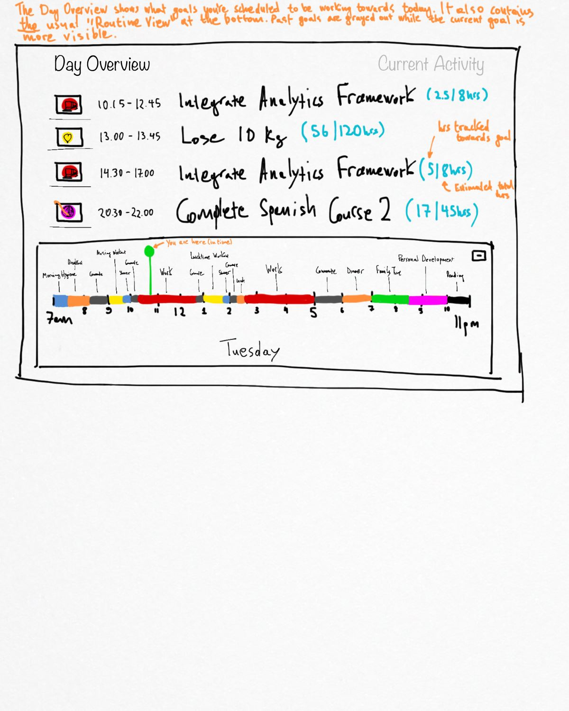
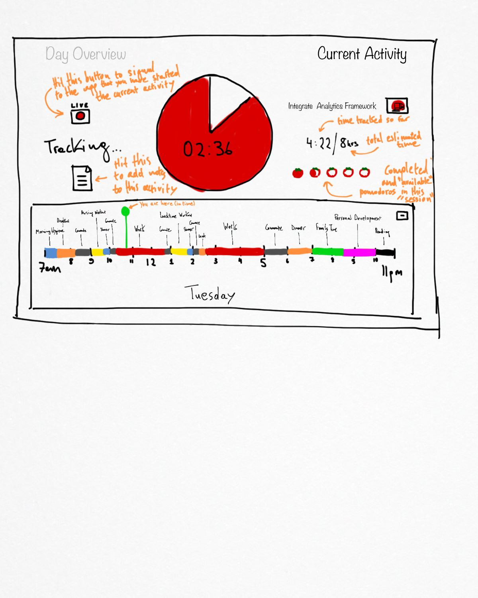
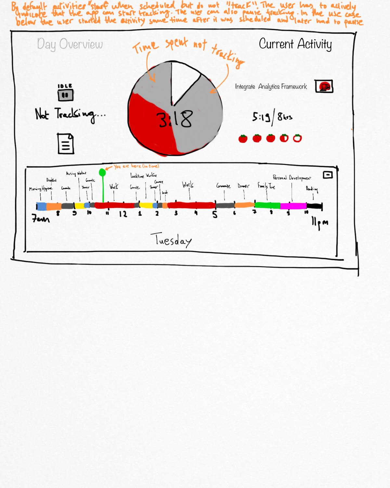

**What the screen is**

*Introduction (p71, typed).* "The routine, , goals and calendar is only half the picture. Once the planning is done the app is meant to be used in the "tracking" mode." Tracking provides the "drumbeat" for the daily routine, "helping you focus and say "no" to distractions both internal and external". It also builds a database of "forecasted goal performance" vs "actual goal performance". That data improves future estimates and shows the user how much time they *actually* have for their goals, as opposed to the time they *think* they have.

*Tabs (p73–p77).* The top left shows "Day Overview" and the top right shows "Current Activity". The active tab is black and the inactive one light grey.

*Day Overview (p73–p74).* The upper half lists today's scheduled goal sessions, one row each. A row has a type icon, a time range, the **goal name** (large) and cyan `(tracked/estimated hrs)`:

| Icon | Time | Goal | Progress |
|---|---|---|---|
| red Work | 10.15-12.45 | Integrate Analytics Framework | (2.5/8hrs) |
| yellow Health | 13.00 - 13.45 | Lose 10 Kg | (56/120hrs) |
| red Work | 14.30 - 17.00 | Integrate Analytics Framework | (5/8hrs) |
| magenta | 20.30 - 22.00 | Complete Spanish Course 2 | (17/45hrs) |

The lower half is a boxed **"Routine View"**: the full 7am–11pm day ribbon, with the day name "Tuesday" below it and a small collapse/minimise icon at the box's top right. A **green lollipop marker** (a stem with a filled circle) crosses the ribbon at about 10:45, inside the first Work block, and marks now. The ribbon's segments are Morning Hygiene, Breakfast, Commute, Morning Workout, Shower, Commute, Work, Commute, Lunchtime Workout, Shower, Commute, Lunch, Work, Commute, Dinner, Family Time, Personal Development (magenta), Reading.

*Current Activity, LIVE (p75–p76).* This view has five areas:
- **Top right:** the current goal's name, "Integrate Analytics Framework", beside the red Work icon.
- **Centre:** a large red **pie timer** with a white wedge from 12 to about 2 o'clock, and the countdown `02:36` inside.
- **Left column:** a "LIVE" label over a framed button with a red record dot, then the text "Tracking...", then a notes/document icon.
- **Right column:** `4:22 / 8hrs`, and below it a row of **5 tomatoes**: 1 full, 1 half, 3 empty.
- **Bottom:** the same "Tuesday" ribbon with the green now-marker.

*Current Activity, IDLE (p77).* The left column shows "IDLE" over a grey pause button (two bars), then "Not Tracking...", then the notes icon. The pie reads `3:18`. The white wedge is still at 12 to 2 o'clock. The rest of the pie is split into **grey** (about 2 to 5 o'clock), red (left and lower left) and **grey** again (about 7 to 12 o'clock). The right column shows `5:19 / 8hrs` and tomatoes with 3 full, 1 half and 1 empty.

**Annotations, verbatim**
> "The tracking mode has two main "tabs": Day Overview and Current Activity" — p73, orange ("Day Overview" and "Current Activity" underlined, with an arrow to each tab label)

> "You are here (in time)" — p73, p74, p76 and p77, orange (arrow to the green lollipop marker). It does not appear on p75.

> "The Day Overview shows what goals you're scheduled to be working towards today. It also contains the usual "Routine View" at the bottom. Past goals are grayed out while the current goal is more visible." — p74, orange ("the" at the start of line 2 is underlined)

> "hrs tracked towards goal" — p74, orange (arrow to the "5" in `(5/8hrs)`)

> "Estimated total hrs" — p74, orange (arrow to "8hrs" in `(5/8hrs)`. "total hrs" is squeezed at the frame edge.)

> (no words) a short orange stroke over the top-left corner of the magenta icon on row 4 — p74. Its meaning is unexplained.

> "The "Current Activity" view is basically a powerful Pomodoro timer that integrates with the Zen Routine Framework. It aims to help you focus while you're working on the task at hand, while at the same time linking with the scheduling and tracking features" — p75, orange

> "Hit this button to signal to the app that you have started the current activity" — p76, orange (arrow to the LIVE button. "have" is written like "hve".)

> "Hit this to add notes to this activity" — p76, orange (arrow to the notes icon)

> "time tracked so far" — p76, orange (arrow to `4:22`)

> "total estimated time" — p76, orange (arrow to `8hrs`)

> "Completed and "available" pomodoros in this "session"" — p76, orange (arrow to the tomato row)

> "By default activities "start" when scheduled but do not "track". The user has to actively indicate that the app can start tracking. The user can also pause tracking. In the use case below the user started the activity some time after it was scheduled and later had to pause" — p77, orange (no closing full stop)

> "Time spent not tracking" — p77, orange (two arrows, one to each grey pie segment)

**Behaviour rules**
- Tracking mode has two tabs: Day Overview and Current Activity (p73). *(With the tab bar kept, these are views inside Home; see `ITERATION-1-PLAN.md`.)*
- Day Overview lists the **goals** the user is scheduled to work on today, one row per session. Each row has a type icon, a time range and the goal name, never just the type (p73–p74).
- One routine block of a type can be shown as a named goal, so the plan can say *which goal* fills a type's block (p73–p74). *Under section 3, decision 1, that goal is derived from list order, not stored on the block.*
- The same goal can appear in several sessions on one day (p73: Integrate Analytics Framework at 10.15 and 14.30).
- Each row shows `(hrs tracked towards goal / estimated total hrs)` (p74).
- **Past goals are greyed out, and the current goal is more prominent** (p74).
- The Day Overview includes the "Routine View" day ribbon at the bottom (p74).
- The ribbon carries a live **"you are here (in time)"** marker (p73–p77).
- Current Activity is a Pomodoro timer linked to scheduling and tracking (p75).
- Current Activity shows these elements:
  - the current goal's name and type icon (p75);
  - a large circular countdown (p75);
  - `time tracked so far / total estimated time` for the goal (p76);
  - a row of tomatoes for the "completed and "available" pomodoros in this "session"" (p76);
  - a notes button (p76);
  - the day ribbon with the now-marker (p75–p77).
- **Scheduled is not the same as tracked.** When its scheduled time arrives, an activity *starts* but does **not** *track* (p77).
- The user must actively tell the app to start tracking, using the LIVE button (p76–p77).
- The user can pause tracking. The state then shows IDLE and "Not Tracking..." (p77).
- Scheduled time that was not tracked is shown as **grey** segments of the pie, labelled "Time spent not tracking". This covers both a late start and a pause (p77).
- Notes can be attached to an activity (p76). *Out of scope for Iteration 1.*

**Open questions / inconsistencies**
- **"Grayed out" versus the drawing.** p74 says past goals are greyed out, but p73–p74 draw every row in the same black ink. At the marked time (about 10:45) no row is in the past, so the rule is stated but never shown.
- **Progress numbers disagree.** At about 10:45, Day Overview row 1 reads `(2.5/8hrs)` and row 3 reads `(5/8hrs)`. The difference is exactly one 2.5-hour block, so the numbers look like *projected at the end of the block*. But Current Activity at about the same moment shows `4:22 / 8hrs`, and p77 shows `5:19 / 8hrs`. It is not said whether Day Overview figures are live, projected or planned. The review reads `4:22 / 8hrs` as lifetime-against-goal. The page's labels ("time tracked so far" and "total estimated time") fit that reading but do not state it.
- **The countdown's meaning.** `02:36` on p75 and `3:18` on p77 are not labelled. They could be pomodoro time left or block time left, and the minutes-versus-seconds format is ambiguous.
- **Pie wedge.** The white wedge (12 to 2 o'clock) is the same on p75 and p77 despite different times. Its meaning (elapsed or remaining) is unstated.
- **Tomato counts.** p75 shows 1 full and 1 half, while p77 (later) shows 3 full and 1 half. Five tomatoes on a 2.5-hour block does not match the 25/5 cadence from later direction.
- **Unrouted blocks.** The ribbon includes Morning Workout, Shower and similar blocks, but Day Overview lists only four goal sessions. Blocks whose type has no goal are not listed, and the design does not say whether they should be.
- **Row 4 icon.** The magenta icon for "Complete Spanish Course 2" matches Personal Development (20:30–22:00 on the ribbon). But the p84 source list gives 20:00–22:00 as Entertainment, and the p69 calendar gives "Spanish Vol 2" a mauve dot.
- **The unexplained orange stroke** on the p74 row-4 icon.
- **Minimise icon** on the Routine View box (p73–p77). Its behaviour is not shown.
- **Stopping, finishing and switching** activity are not shown. Only start (LIVE) and pause (IDLE) are.
- **Tab label wording.** The annotation says "tabs" in quotes, which suggests they may not be literal tabs.

---

### 4.7 Notifications (p78–p80)

> **Superseded as the default flow** by the catch-up queue (section 3, decision 4; Iteration 2). This section is kept as a record of the original intent.

**Pages:** p78, p79, p80.

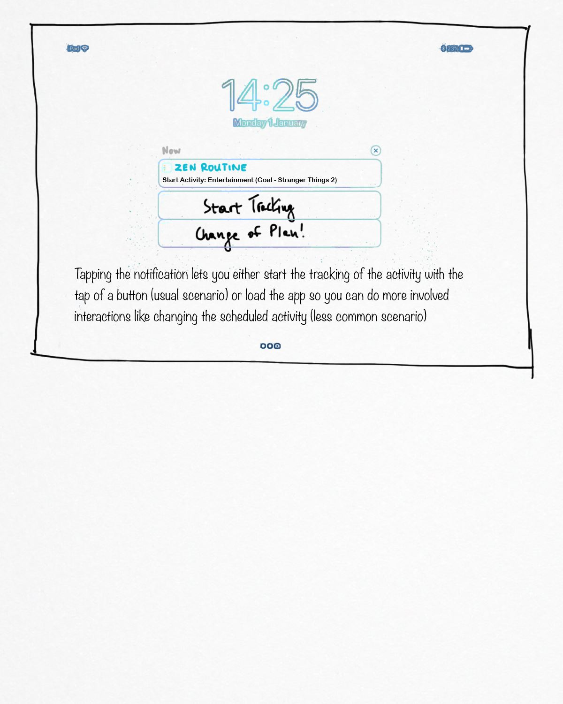

**What the screen is**
- **p78.** An iPad lock screen with the status bar ("iPad", wifi, bluetooth, 23%), the clock `14:25` and the date "Monday 1 January". It shows one notification card: header "Now" with an (x) button, app name "ZEN ROUTINE" in cyan with an app icon, and the typed body "Start Activity: Entertainment (Goal - Stranger Things 2)".
- **p79–p80.** The same card expanded, with two stacked rounded action buttons: "Start Tracking" and "Change of Plan!". The p80 drawing is identical to p79.

**Typed page text (not handwritten)**
- p78: "Users wouldn't normally manage the flow of their daily routine via the app itself, instead it would be managed via a notification driven system and a few simple interactions which would usually take place within the notification itself."
- p79: "Tapping the notification lets you either start the tracking of the activity with the tap of a button (usual scenario) or load the app so you can do more involved interactions like changing the scheduled activity (less common scenario)"
- p80: "Of course if you miss a notification and the app erroneously assumes an activity was not performed at the scheduled time when it actually was, you can always manually add tracking data later"

**Annotations, verbatim**
None. These pages carry no handwritten annotations.

**Behaviour rules (original intent)**
- A notification fires when an activity is scheduled to start. It names the activity type and the goal: "Start Activity: Entertainment (Goal - Stranger Things 2)" (p78).
- The notification offers "Start Tracking" (the usual case) or "Change of Plan!", which opens the app to change the scheduled activity (p79).
- Tracking data can be added manually later (p80).

**Open questions / inconsistencies**
- p80 describes adding tracking data manually, but no UI for it is drawn anywhere.
- The p78 notification names a goal for an Entertainment block, which fits goals being derived from their type (section 3, decision 1).
- The "Change of Plan!" flow is not drawn.

---

### 4.8 Out of scope pages (p81–p85)

**Pages:** p81 ("Metrics/Analysis" with "(TODO)"), p82 ("Notes/Doodles", typed "These next pages are not part of the spec so ignore them"), p83 (an empty iPad frame with one dropdown), p84 (sample weekday routine), p85 (unlabelled text field and dropdown).

**What they are.** p81 is a placeholder for an analytics section that was never designed. p82 declares everything after it **outside the spec**. p84 is still useful as reference data: it is the timed source list for the Tuesday ribbon drawn on p73–p77.

| Time | Activity | Colour |
|---|---|---|
| 7.30-8 | Breakfast | orange |
| 8.15-8.45 | Commute | dark grey |
| 9-9.45 | Morning Workout | yellow |
| 9.45-10 | Shower | blue |
| 10-10.15 | Commute | dark grey |
| 10.15-12:45 | Work | red |
| 12.45-13.00 | Commute | dark grey |
| 13.00-13.45 | Lunchtime Workout | yellow |
| 13.45-14:00 | Shower | blue |
| 14:00-14:15 | Commute | dark grey |
| 14:15-14:30 | Lunch | orange |
| 14:30-17:00 | Work | red |
| 17:00-18:00 | Commute | dark grey |
| 18:00-19:00 | Dinner | orange |
| 19:00-20:00 | Family Time | green |
| 20:00-22:00 | Entertainment | salmon/pink |
| 22:00-23:00 | Read | black |

**Annotations, verbatim:** none.

**Behaviour rules:** none. Do not build from p82–p85 (p82).

**Open questions / inconsistencies**
- p84 has no Morning Hygiene entry, although the ribbon starts with a blue block at 7am. It also leaves 8.00–8.15 unaccounted for.
- p84 lists 20:00–22:00 as Entertainment, while p73–p77 draw that span as Personal Development (magenta, from about 20:30 in Day Overview).
- Analytics (p81) is undesigned. The existing Analytics tab is a post-2019 addition (`ITERATION-1-PLAN.md`).

---

## 5. Colour and activity-type key

The design never defines a palette. This key is inferred from the labelled mocks.

| Colour | Used for | Pages | Notes |
|---|---|---|---|
| blue | Hygiene / Shower / Morning Hygiene | p21–p24, p84 | Also the unnamed envelope goal type (p59) |
| orange | Meals: Breakfast, Lunch, Dinner | p24, p84 | Also Entertainment's bar on p43 (conflict) |
| dark grey | Commute | p24, p43, p84 | Also untracked time in the p77 pie |
| yellow | Workout / Health / Fitness | p24, p38, p43, p53 | Named "Health" in pickers, "Fitness" on p43 |
| red | Work | p24, p38, p43, p53 | |
| green | Family Time | p24, p43, p84 | Also "Take Kids Kayak..." on p69, and ticks and "50%" on p69 |
| salmon / pink | Entertainment | p24, p37, p53, p84 | Orange on p43 |
| magenta | (Personal) Development | p39–p41, p43, p53 | Also "Catch up with Stra..." on p69 (conflict) |
| black | Reading | p24, p84 | |
| cyan | Tracking UI: stopwatch icon, progress figures, app name | p72–p74, p78 | UI colour, not a type |
| light blue | Calendar icon | p68, p72 | UI colour, not a type |
| dusty pink / mauve | "Spanish Vol 2" | p69 | Matches no other type |

Icons drawn: shower head (Hygiene), game controller (Entertainment), heart (Health), brain or globe (Development), vehicle or computer (Work), envelope (unnamed blue type).

---

## 6. Glossary

- **Activity type.** A user-defined category with a **Name, Colour and Icon** (p20–p21), for example Work, Health, Hygiene or Entertainment. It is the only thing a routine is made of (p05; section 3, decision 1). A goal may optionally have one (p51).
- **Routine.** A weekly plan: activity types placed on a Monday-to-Sunday timeline (p05, p10). A user may save several routines, and one is "currently active" (p06, p69).
- **Block / activity.** One entry in a routine: a start time, an end time and an activity type, drawn as a segment of the ribbon (p17–p24). The design uses "activity" for both the block and, loosely, its type. Blocks carry display labels such as "Morning Workout" (p24).
- **Ribbon.** The horizontal 7am–11pm bar of coloured blocks with labels above them. It is the day editor (p24, p31–p41), and it also appears as the "Routine View" at the bottom of every tracking screen (p73–p77). It is squashed into a stripe cell in the week strip (p25, p42).
- **Week strip.** Seven cells labelled `M T W T F S S`, each holding a squashed day ribbon (p10, p25, p42).
- **Goal.** A named item in an ordered list, ideally measurable (p03), with an optional type and an optional estimate (p51) and a done checkbox. Its priority is its position in the list (p65–p67).
- **Estimate.** The total time a goal is expected to take, for example `10hrs` or `20min`. It is optional and defaults to `1hr` on a new row (p50–p59).
- **Forecast.** The date each goal is predicted to complete (or reach a % milestone), computed from the goals and the active routine and shown on the calendar (p69).
- **Scheduled / started / tracked.** An activity is *scheduled* by the routine. It *starts* automatically at its scheduled time. It is *tracked* only while the user has indicated LIVE, and it can be paused (IDLE). Time that was scheduled but not tracked is shown as grey (p76–p77).
- **Pomodoro.** A focused work interval, counted in tomatoes. The Current Activity view is "basically a powerful Pomodoro timer" (p75), and the tomato row shows completed and "available" pomodoros in the current session (p76). The 25/5/×4→15 cadence comes from later direction (section 3).
- **Session.** In the tomato annotation, the current stretch of work on an activity (p76). Its limits are not defined.
- **Day Overview.** The tracking tab that lists today's scheduled goal sessions and the day ribbon (p73–p74).
- **Current Activity.** The tracking tab with the Pomodoro timer for the goal being worked on now (p75–p77).
- **"You are here (in time)".** The green lollipop marker on the ribbon that shows the current time (p73–p77).
- **Planning / Tracking modes.** The two modes of the app, switched with the stopwatch and calendar icons (p68, p72). *In the current build these live in the tab bar instead (section 3).*

---

## 7. Corrections to the 14 Sep review

`docs/REVIEW-2026-09-14.md` quoted annotations from memory of the pages. Checked against the renders, the following need correcting.

1. **The mode icons are not on pp. 42–45.** Review Part 1 places the calendar and stopwatch icons on "pp. 42–45". They are not on any page from p42 to p45. The calendar icon first appears on **p68** ("Tap here to switch to calendar view"). The stopwatch appears on **p72** ("Tap the stopwatch to switch to tracking mode"). The single surface with the week strip, pie and goals is drawn on p44–p45, p68 and p72.
2. **Annotations start before p. 36.** The review says the handwritten annotations run "From p. 36 onward". Red annotations begin on **p10**, and a black note appears on **p03**. Orange annotations begin on **p44**.
3. **"Drag and move rows around to reprioritise"** is on **p65 and p66**, in red. It is not on p67 and not anywhere in p44–p64.
4. **"Adding Goals in filtered lists…"** is on **p67** (orange). That confirms the review's page.
5. **"The 'Current Activity' view is basically a powerful Pomodoro timer…"** is on **p75**. Its wording differs from the review: the page has double quotes, "Zen Routine **F**ramework" with a capital F, and "features" with no full stop.
6. **"The Day Overview shows…"** is on **p74**. The page spells it "**grayed** out", where the review has "greyed out". The page puts "Routine View" in double quotes, where the review uses single quotes.
7. **"Activity Type and Estimation are optional…"** is on **p51**. The page reads "(**T**his allows … simple **ToDo** list if desired **-** i.e. no scheduling functionality)". It has a capital T, a hyphen rather than an em dash, and "ToDo" is written close to "TODO". The first sentence is a separate line with no parenthesis.
8. **The p69 calendar note** differs in small ways from the review: the page has "**"at a glance"**" in quotes with no hyphens, "**re prioritize**" with no hyphen, and no closing full stop.
9. **"time spent not tracking"** is on **p77** and is capitalised on the page: "**Time** spent not tracking".
10. **"hit this to add notes to this activity"** is on **p76** and is capitalised on the page: "**Hit** this to add notes to this activity".
11. **The p77 note** puts "start" and "track" in **double** quotes (the review uses single quotes), and it ends with no full stop.
12. **"The same ribbon reappears unchanged at the bottom of every tracking screen (pp. 74–77)"** should read **pp. 73–77**. p73 already has the ribbon and the "You are here (in time)" marker.
13. **The review reads `4:22 / 8hrs` as "lifetime against the goal, not today".** p76 only labels the figures "time tracked so far" and "total estimated time". The lifetime reading is an inference, supported by p74's "hrs tracked towards goal" but not stated on the page (see the open questions in section 4.6).
14. **The review's pp. 36 and 41 for the ribbon editor** are right but narrow. Adding activities is on p13–p16, the edit box on p17–p22, copying a day on p29, and pinch zoom and dragging extents on p31–p35.
15. **Pomodoro timings.** The review's "25, 5, 25, 5, … 15-minute break" is the director's spoken direction (09:30). The design shows five tomatoes and no durations.

`ITERATION-1-PLAN.md` also cites the Routine surface as "pp. 36, 41–43". The fuller range is **pp. 10–43**. It cites Home / Day Overview as "pp. 73–77", which is right; Current Activity is p75–p77.
